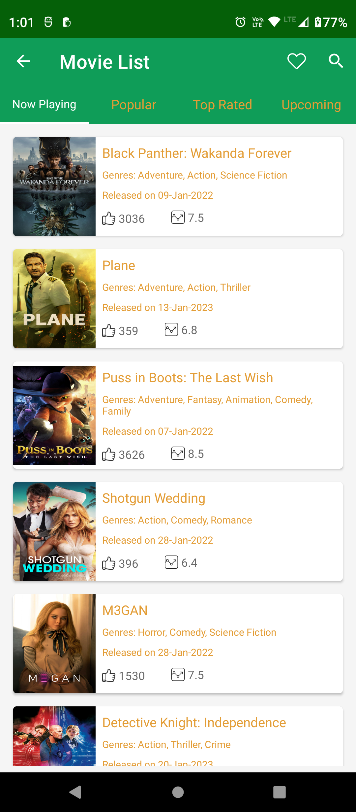

# MovieDBApp
Movie app is designed to helps customers to search movies, save to favourites & also user can find now playing, popular, top rated & upcoming list.

To complete this assignment I was more focused at architecture & flow of the app & UI.

For this project I have used:

- **Latest version** - Android Studio Dolphin

- **Modular** - The app is broken into modules of features and libraries which can be combined to build instant-apps, complete apps or lite version of apps.

- **MVVM architecture** - Using the lifecycle aware viewmodels, the view observes changes from viewmodel.

- **Kotlin** - This app is completely written in Kotlin.

- **Android Architecture Components** - Lifecycle awareness has been achieved using a combination of Statemaps, ViewModels, Room database Hilt, View binding.

- **Screen compatibility** - This app is compatible up-to 10 inch screen size.

- **Screen Orientation**  - Handled the portrait & landscape mode & persistence of onConfigurationChanges.

# Screenshots:
      

      

      

      

# Libraries used

* [Android Support Libraries](https://developer.android.com/topic/libraries/support-library/index.html)
* [Retrofit](http://square.github.io/retrofit/)
* [OkHttp](http://square.github.io/okhttp/)
* [Room](https://developer.android.com/topic/libraries/architecture/room.html)
* [ViewModel](https://developer.android.com/topic/libraries/architecture/viewmodel.html)
* [LiveData](https://developer.android.com/topic/libraries/architecture/livedata.html)
* [MPChart](https://github.com/PhilJay/MPAndroidChart)
* [DaggerHilt](https://dagger.dev/hilt/)
* [JUnit](https://developer.android.com/training/testing/local-tests)
* [Picasso](https://github.com/square/picasso)
